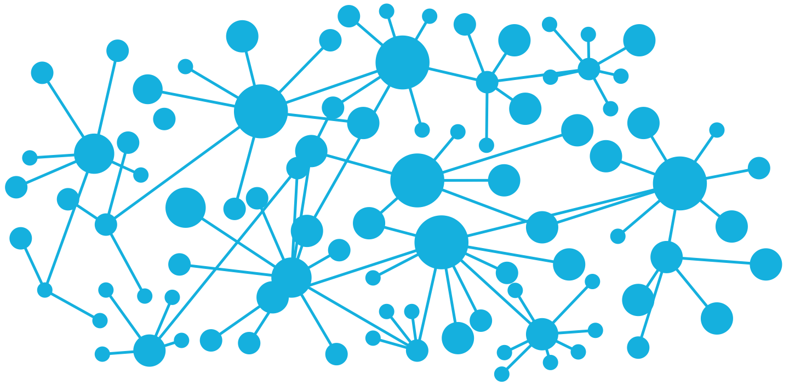

# Informe 2 | Direccionamiento IP y enrutamiento

<br>


**Redes y Sistemas Distribuidos - Escuela Superior de Ingeniería y Tecnología de la ULL**


<br>
<br>
<br>
<br>
<br>
<br>
<br>




<br>
<br>
<br>
<br>
<br>
<br>
<br>

    Informe realizado por Éric Dürr Sierra y Noah Sanchez
                           (alu0101027005)   (alu00000000)
<br>
<br>
<br>
<br>

<!-- fin de la página de portada --->
***
El siguiente documento contiene los distintos apartados que comprenden el informe sobre las prácticas 1 y 2 del entregable 2. A grandes rasgos pretenden hacer un repaso sobre los procesos de la capa de red (capa 4 en TCP/IP). 

También contiene un resumen de los comandos empleados así como una conclusión de evidencias del trabajo en grupo.

<br>
<br>
<br>


<div id="init"></div>


## **Índice**

## 1. [Introducción](#id1)
## 2. [Enruitamiento estático](#id2) 
## 3. [Enruitamiento dinámico](#id3)
## 4. [Resumen de comandos](#id4)
## 5. [Evidencias del trabajo en grupo](#id5)
## 6. [Referencias](#id6)


<br>
<br>
<br>
<br>
<br>
<br>
<br>
<br>
<br>
<br>
<br>
<br>
<br>
<br>
<br>
<br>
<br>
<br>
<br>
<br>
<br>
<br>
<br>
<br>

***

<!-- fin de la página de índice --->
<br>
<br>
<br>
<br>


<div id="id1"></div>

## 1. INTRODUCCIÓN

<br>
<br>

### **Descripción general del entregable**

Esta entrega de prácticas se va a centrar específicamente en las particularidades de la capa de red, concretamente en los aspectos relativos al Direccionamiento IP y al enrutamiento, tanto estático como dinámico. El volumen de trabajo se ha dividido en dos prácticas distintas; la primera  de ellas se centra en el enrutamiento estático y la asignación de direcciones IP en función de las características de la red. La segunda práctica tratará de forma más específica los aspectos del enrutamiento dinámico y la sumarización de redes, asumiendo aspectos de la práctica primera no sin ponerlos en uso. 


<br>
<br>

### **Objetivos de la parte de enrutamiento estático**

La práctica 1 tiene como principales objetivos:

- Entender el proceso de asiganción de direcciones.
> Se nos proporcionan datos mediante los que deducir y calcular las direcciones IP.
- Entender el funcionamiento del enrutamiento.
> Mediante la configuración de los dispositivos de red se pretende introducir estos conceptos.
- Saber asignar direcciones a las interfaces de un host y/o router.
- Saber configurar la puerta de enlace por defecto de un host.
- Saber añadir / eliminar entradas de la tabla de enrutamiento.
- Saber añadir una ruta por defecto a los router
> Todas las anteriores son técnicas que tendremos que aprender a aplicar a la configuración de la red.


A modo de resumen esta práctica pretende introducir conceptos básicos de asignación de direcciones en una red y el enrutamiento de sus dispositivos. Es un primer contacto con
las funcionalidades que manipularemos en la red.

<br>
<br>

### **Objetivos de la parte de enrutamiento dinámico**

La práctica 2 tiene como principales objetivos:

- Conocer el funcionamiento del protocolo RIP y sus características.
- Ser capaz de hacer funcionar el enrutamiento dinámico mediante RIP en una red.
- Comprender la unidad de los comandos network y neighbor, además de la diferencia entre ellos.
- Denominar el concepto de interfaz pasiva, saber cuando se aplica y conocer los comandos necesarios.
- Saber ccómo configurar para que propague una ruta por defecto.

Se puede apreciar como en este caso se extiende de la práctica 1 y asumimos tareas que ya se han empleado anteriormente para pasar, en esta ocasión, a la configuración de los protocolos de red. Concretamente debemos adaptar los router para intercomunicarse mediante RIP (Routing Information Protocol) extendiendo también conceptos aplicados anteriormente que serán cruciales para una configuracdión "limpia" de una red con este protocolo

<br>
<br>

### **Tecnologías usadas**

En ambas prácticas debemos simular distintas redes junto a sus dispositivos de red, hosts y demás características. Para ello se emplea una interfaz gráfica de simulación de red denominada GNS3 (Graphical Network Simulator - 3) que nos facilita un entorno aislado donde cada dispositivo dispone de todas las utilidades de una máquina real.

Emplea Dynamips, un software que permite simular Cisco IOS (Cisco Internetwork Operating Systems). Que no es otra cosa que el sistema operativo empleado en múltiples routers y switches de Cisco.

Además esta herramienta de simulación nos permitirá hacer capturas de la red con el uso de Wireshark entre las distintas interfaces del entorno que estemos emulando.


<br>
<br>
<br>
<br>


<div id="id2"></div>


## 2. ENRUTAMIENTO ESTÁTICO
En esta parte del entregable la práctica se centra en cuestiones teóricas tales como: la asignación de direcciones IPv4 o la manipulación del enrutamiento de la red por medio de las interfaces de red ( *ethX* ) y la tabla de enrutamiento.

Además se introducirán todos los pasos y comandos básicos necesarios para la configuración de las interfaces de red de los host y los router, la comprobación de sus estados y el enrutamiento entre las redes de la organización. Estos comandos se encuentran detallados en el [listado del apartado 4 del informe](#id4)

<br>
<br>

### **Descripción del concepto**


La asignación de direcciones IPv4 va a requerir de una serie de cálculos explicados en la teoría de la asignatura. En base al número de bloques, redes y el prefijo global de la red ( que lo suministra el ISP y debe ser indicado ) se determinará un prefijo a cada una de las redes del sistema que debemos configurar. En resumen esto nos permitirá hallar datos necesarios para la configuración como:

- Dirección de red
- Máscara de red
- Dirección broadcast
- Dirección de cada uno de los host de nuestra red

Cabe destacar que en la asignación de redes a cada host no podemos asignar ni la dirección de red ni la dirección broadcast, ya que estos son reservados para este propósito.

Para aplicar el direccionamiento IPv4 debemos tener en cuenta una serie de aspectos que son cruciales para su cálculo:

- Las direcciones IP se componen por 32 bits, separados por grupos de 8 bits, que son separados por un punto y escritos en notación decimal. Van desde *0.0.0.0* hasta *255.255.255.255* .

- Estas direcciones se dividen en dos componentes uno de **red**; que denota la red en la que estamos direccionando y uno de **host** que indica el dispositivo concreto al que estamos haciendo referencia. 

- Para distinguir el número de bits al que corresponde cada división empleamos la máscara de red. Esta es un número de 32 bits similar a la dirección IPv4 donde los *1´s* indican la parte de red y los *0's* la de host.

- Se pueden emplear la notacion decimal o, en nuestro caso, la CIDR que indicará el número de bits que corresponden a la parte de red tras una barra ( **/n** ). El número de bits de host se deduce como  32 - n, donde n es la cifra en CIDR.

Tal como se menciona, la notación a emplear es la CIDR para las máscaras de red. De esta manera pretendemos indicar que se emplea un direccionamiento sin clases. Este tipo de direccionamiento nos permite un uso más economizado de la red por medio de una asignación VLSM (Virtual Length Subnet Mask) de las máscaras de red, cuyo tamaño de bloque ajusta el número de bloques necesarios respecto al número de hosts.

El encaminamiento que se emplea es estático, por ende las rutas entre cada par de nodos es permanente. El cómputo de la ruta a seguir dentro de la red en este sistema emplea algoritmos de caminos mínimos tales como *Dijksta* o *Bellman-Ford*.

Se detalla la función de reenvío de la capa de red aplicando la tabla de enrutamiento de los dispositivos de red. Es en este punto donde estableceremos las interfaces de red y sus redes relacionadas. Se debe destacar que cada router debe disponer de su propia tabla de enrutamiento. Nos deben quedar claros los dos apartados que la componen:

- Patrón: Que denota la entrada a la que se dirige por medio de la red y su máscara.

- Acción: Que denota la red hacia la que se va a redirigir.

Las entradas de la tabla de enlace podrán ser:

- Directas: que indican las redes directamente conectadas al dispositivo. Por ejemplo en nuestra práctica, para el dispositivo *QuaggaRouter-1* son las redes *A* y *D* tal y como se puede apreciar en [la plantilla](#plantilla)

- No Directas: que requieren de, al menos ,pasar por otro dispositivo de red y que a diferencia de las directamente conectadas requieren que se les indique un *gateway*. El ***gateway*** no es otra cosa que la dirección de la interfaz de red del primer salto efectuado para el acceso a la red. Esta se indica en el apartado de acción. Para el dispositivo *QuaggaRouter-1* son las redes *B*, *C* y *E*. Para este el gateway de acceso a la red *C* sería la dirección introducida en el *eth0* del *QuaggaRouter-2*.

Conceptos más avanzados del direccionamiento y la redirección tales como la sumarización de redes o el uso de algoritmos de enrutamiento serán aplicados y expuestos en el [apartado 3 de este informe](#id3).


<br>
<br>

### **Descripción de los pasos realizados**

Para realizar la práctica partimos de una plantilla que contiene la estructura básica de las redes que componen el sistema. Los dispositivos están conectados pero no configurados por lo que no hay tráfico de red entre ellos. Nuestra labor es, por medio de cada una de las interfaces, configurar todos los aspectos necesarios para su comunicación en calidad de que se establezca un enrutamiento estático.

La plantilla sobre la que se va a operar consta de 3 router interconectados entre sí, donde dos de ellos se disponen a los extremos y cada uno de ellos sirve de enlace para cada una de las redes de hosts, que también son 3. Cada una de las redes de hosts contiene de un número de equipos concreto que, en orden, son: 50, 127 y 30.


<div id="plantilla"></div>


Una vez hemos aclarado la topología de nuestra red se puede comenzar con el diseño de la misma. De esta manera el primer paso es realizar una asignación de las  direcciones de nuestra red. Para ello hay que tener en cuenta los aspectos teóricos mencionados en el anterior apartado ya que vamos a aplicar un método VLSM de direccionamiento IPv4. 

De esta manera vamos a deducir el tamaño de los bloques hallando la primera potencia de 2 que se ajuste al número de hosts más las dos direcciones especiales de broadcast y red:

- Para A: 50 + 2 &#8594; 2^6 = 64
- Para B: 127 + 2 &#8594; 2^8 = 256
- Para C: 30 + 2 &#8594; 2^5 = 32

y para el tamaño de los bloques de las redes de interconexión de los router debemos aplicar las dos direcciones de la conexión punto a punto más las dos especiales:

- Para D: 2 + 2 &#8594; 2^2 = 4
- Para E: 2 + 2 &#8594; 2^2 = 4

Una vez tenemos el tamaño de los bloques se puede deducir fácilmente el número de la máscara de red en CIDR. Este se obtiene restando a 32 (que son todas las direcciones posibles) el número de la potencia de la que se obtiene el bloque (que indica la cantidad de hosts direccionables), este resultado no es otro que la parte de red de la máscara así pues:

- Para A: 32 - 6 = /26 
- Para B: 32 - 8 = /24
- Para C: 32 - 5 = /27
- Para D: 32 - 2 = /30
- Para E: 32 - 2 = /30

Para finalizar la asignación de las direcciones IPv4 solo quedaría disponer todo en una tabla ordenando las redes de mayor a menor número de hosts y calcular cada una de las direcciones de red realizando el desplazamiento del tamaño del bloque dentro del prefijo. El broadcast será el resultado de la suma entre la dirección base y el tamaño del bloque - 1.

Una vez disponemos de los prefijos de cada subred solo quedaría asignar una dirección a cada uno de los dipositivos del esquema de manera que estas direcciones se encuentren dentro de su parte de la red y no ocupen ni la dirección de red ni la de broadcast.

En este caso se asignan en el siguiente orden: **[ router  ]&#8594; [ PC-1 ]&#8594; [ PC-2 ] · · · &#8594; [ PC-N ]**

(Este orden no condiciona los resultados)

    Por ejemplo en la red A (8.0.1.0/26):

        Router 1 = 8.0.1.1/26
        Router 2 = 8.0.1.2/26
        Router 3 = 8.0.1.3/26

Para asignar estas direcciones debemos emplear una serie de comandos a través de la consola de cada uno de los dispositivos de red y de los PC que vamos a conectar. 

Comenzando por los PC de la red el proceso puede optar por varias soluciones. La primera de ellas es acceder a la linea de comandos *(click derecho sobre el dispositivo > abrir consola)* y una vez allí activar de forma manual la interfaz de red que vayamos a conectar con la dirección IP que le corresponde:

1. Visualizar el estado de las interfaces de red, usamos: ```ifconfig ``` o ```ip addr show```
    > Esto nos permitirá evaluar los cambios que debemos aplicar y en qué interfaz.

2. Para establecer una dirección de red a una interfaz se emplea: &emsp;&emsp;&emsp;&emsp;&emsp;&emsp;&emsp;&emsp;&emsp;&emsp;&emsp;&emsp;&emsp;&emsp;&emsp;&emsp;&emsp;&emsp;&emsp;&emsp;&emsp;&emsp;&emsp;&emsp;&emsp;&emsp;```ifconfig [INTERFAZ] [DIRECCIÓN IPv4/MÁSCARA]``` o ```ip addr add [DIRECCIÓN IPv4/MÁSCARA] dev [INTERFAZ]```

    > para poder aplicar estos comandos debe ingresar como super usuario. Para reasignar con **ifconfig** solo se repite el comando con una dirección nueva, pero con **ip addr** se debe borrar la anterior dirección asignada a la interfaz.

Sin embargo esta configuración no permanecerá tras el reinicio de las máquinas. Para poder establecer unas direcciones que permanezcan activas se debe editar un fichero que contiene la confifuración de las interfaces de red: ```/etc/network/interfaces```. Este será leido por el sistema operativo de los ordenadores para que, en el arranque, sean configuradas estas interfaces. Se debe editar de la siguiente manera:
```bash

    auto [INTERFAZ]
    iface [INTERFAZ] inet static
    address [DIRECCIÓN IPv4/MÁSCARA]
    gateway [DIRECCIÓN GATEWAY]

    #auto otrainterfaz
    iface otrainterfaz inet dhcp

```
Tal y como se puede apreciar en el fragmento de código anterior hay que efectuar una serie de pasos:

1. descomentar la linea auto de la interfaz a establecer.
    >Esto va a permitir configurar la interfaz en el arranque del sistema.
2. cambiar la inet de ***dhcp*** a ***static***.
    > Para aplicar enrutamiento estático.
3. añadir la dirección de red del dispositivo junto con su máscara en CIDR.
4. añadir la dirección del ***gateway*** (sin máscara ya que en este caso no aplica)
    > El *gateway* corresponde con la dirección de red de la primera interfaz contactada a la hora de realizar un salto hacia otra red (la interfaz del router que conecta con el PC) 

Una vez terminado de editar este fichero se debe guardar y ejecutar: ```ifup [INTERFAZ]```

Este último paso activará la interfaz y aplicará la configuración. En caso de necesitar resetear la interfaz se debe volver a encender con el mismo comando tras apagarla usando: ```ifdown [INTERFAZ]```

Esta configuración se debe aplicar a todos los PC's de la red que estamos configurando en base a sus interfaces y sus direcciones IP.

Tras haber configurado los PC's habrá que configurar los router mediante la linea de comando de los mismos. Para ello debemos abrir la terminal del router tal y como se ha hecho con los PC. Una vez dentro accederemos a la plataforma Quagga que permite la configuración mediante un sistema Linux. Para acceder a la configuración:

1. Ejecutar el comando `vytsh`
    >Esto abrirála interfaz de comandos del sistema de enrutamiento Quagga. Por defecto como usuario privilegiado.
2. Ejecutar `configure terminal`
    >En este punto ya podremos ejecutar los comandos de cinfiguración del dispositivo de red.
3. Ejecutar `interface [INTERFAZ]`
    >Tras esto accederemos específicamente a la configuración de la interfaz de red indicada
4. Asignar la dirección IP a la interfaz mediante: `ip address [DIRECCIÓN IP/MÁSCARA]`.
5. Debemos activar la interfaz para que se ponga en marcha: `no shutdown`.
6. También activaremos la detección del enlace: `link-detect`.
7. Debemos salir de la interfaz de configuración con: `exit`.

Este proceso debe repetirse con cada una de las interfaces del router. Una vez hecho se sale del modo de configuración ejecutando `exit` y antes de finalizar con este router se deben guardar los cambios ejecutando `write` , de lo contrario al reiniciar el sistema esta configuración será deshecha.

La configuración de las interfaces debe repetirse con todos los router de la red y una vez esto se haya finalizado tendremos establecidas conexiones punto a punto. Estas conexiones las podremos comprobar ejecutando el comando `ping [DIRECCIÓN]` con cada una de las conexiones directas de cada red, sin embargo no será posible acceder a redes no directamente conexas. Para solucionar esto, dado que el enrutamiento es estático se deben configurar manualmente cada una de las tablas de enrutamiento de cad auno de los dispositivos de red.


1. Volver a entrar a la interfaz de configuración de la terminal del router: consola > `vtysh` > `configure terminal` 

2. Ejecutar: `ip route [DIRECCIÓN/MÁSCARA] [GATEWAY]`
> Con este comando introducimos el enlace de destino y el gateway al que queremos acceder, añadiendo así de manera estática una entrada en la tabla de enrutamiento.

Esto se debe hacer con cada una de las redes que queramos conectar en cada router de la topología. De nuevo cabe recordar que si queremos que se guarde el cambio se debe executar `write` en la interfaz de ***vtysh***. De lo contrario la configuración, al reiniciar las máquinas, desaparecería.

En este punto ya podríamos ejecutar el comando `ping [DIRECCIÓN]` y se debería de poder acceder a cualquier red desde cualquier dispositivo. En caso negativo ejecutar el comando `traceroute` nos dará pistas del disposit6ivo que está mal configurado y donde puede localizarse el error.


El último paso que restaría sería configurar las rutas por defecto en los router para resolver solicitudes en la tabla que no coincidad con las entradas ya dispuestas. En este caso se envía la ruta por defecto hacia ***QuaggaRouter-1***. Por ende, en cada uno de los router debemos seguir los siguientes pasos:

1. Entrar en la interfaz de configuración del router como se ha hecho anteriormente: consola > `vtysh` > `configure terminal` 

2. Ejecutar ``ip route 0.0.0.0 0.0.0.0 [GATEWAY]``
> Este comando añade una entrada a la tabla de enrutamiento que hará coincidir en caso de no asignarse a ninguna de las redes previstas. Esta debe ser todo 0 y su máscara de red debe ser igualmente todo 0. Por otro lado la interfaz a la que se dirige debe ser el gateway hacia *QuaggaRouter-1*.

Esto debe repetirse en todos los router.

<br>
<br>
<br>
<br>


<div id="id3"></div>


## 3. ENRUTAMIENTO DINÁMICO

En este apartado nos vamos a enfocar, al igual que en la parte de Enrutamiento Estatico, en asignar direcciones IPv4 y la configuracion de R.I.P, una herramienta que nos permitira enrutar los routers de forma dinamica. Tambien nos centraremos en el uso de los comandos ```neighbor``` y ```network```, el concepto de interfaz pasiva y saber cuando asignar rutas por defecto.

Podemos ver todos los pasos realizados en la configuracion de R.I.P, asi como la comprobacion de las tablas de enrutamiento dinamicas, el envio de paquetes y otros comandos como neighbor y network en el [listado del apartado 4 del informe](#id4)


<br>
<br>

### Descripción del concepto

Como mencionamos en la primera parte del informe, primero tendremos que calcular las direcciones que asignaremos al objeto correspondiente (PC, tarjeta de red o QuaggaRouter). A partir de las redes que se nos facilitaban en el guion obtuvimo los datos necesarios, como el tamaño del bloque, la direccion de broadcast, y las direcciones de los host.

R.I.P (Routing Information Protocol) es un protocolo de enrutamiento de pasarela interior. Se basa en el algoritmo de Bellman-Ford. Actualmente, existen tres variantes del mismo, pero nos enfocaremos exclusivamente en la version 2, que es una ampliacion de RIP para admitir direccionamiento sin clases (CIDR/VLSM).

La metrica utilizada en RIP es el ńumero de saltos, esta esta limitado a 15. Cada uno de los routers que intervienen aplican el un procedimiento:

1. Mantener una tabla con una entrada para cada uno de los posibles destinos en la red. Junto con cada uno de los destinos se guarda la distancia para llegar a ese destino (en RIP el numero de saltos) y el siguiente salto.

2. Periodicamente (En RIP cada 30 segundos) se envía un paquete de actualización a cada vecino. Este paquete de actualización contiene los destinos de la tabla mencionada anteriormente junto con los costes para llegar a los mismos.

3. Cuando llega un paquete de actualización a un vecino,  ́este añade el coste del camino por el que llego el paquete (1 para RIP) a cada entrada de la tabla recien llegada y la compara con su propia tabla. 

Para cada destino, si el coste recien obtenido es menor que el almacenado en la tabla se actualiza la tabla con el nuevo coste y el siguiente salto se convierte en el vecino que envió el paquete de actualizacion. En el caso de que el siguiente salto en la tabla coincida con el vecino que ha enviado el paquete siempre se procede a actualizar la tabla, aunque la nueva distancia sea mayor.

Cabe destacar que en esta parte del entregable vamos a configurar una red corporativa formada por subredes, que luego, se une a un red que simula Internet, el conjunto de subredes que forma la red corporativa usa direccionamiento privado, y la red que simula internet usa direccionamiento publico, si aplicasemos esto a la vida real, seria imprescindible el uso de una N.A.T (Network Address Translation) 

N.A.T es un mecanismo utilizado por routers IP para intercambiar paquetes entre dos redes que asignan mutuamente direcciones incompatibles. Consiste en convertir, en tiempo real, las direcciones utilizadas en los paquetes transportados. También es necesario editar los paquetes para permitir la operación de protocolos que incluyen información de direcciones dentro de la conversación del protocolo.


<br>
<br>

### Descripción de los pasos realizados

Al igual que en la practica anterior, en esta hacemos uso de una plantilla con la estructura de las redes que vamos a configurar. La plantilla es solamente grafica, no contiene ningun dato, a a parte de las tarjetas de red, las cuales vamos a configurar para que el sistema funcione correctamente.

La plantilla consta de sistemas autonomos unidos entre si, el primer sistema autonomo es la red corporativa que contiene 3 QuaggaRouters unidos entre si, uno de ellos contiene una subred con un PC, luego, en la interconexion de los dos QuaggaRouters restantes se aloja una subred con dos PC´s, finalmente, uno de los QuaggaRouter hace de interconexion hacia el otro sistema autonomo, que en esta practica actuara como Internet, este sistema contiene un solo QuaggaRouter y un PC

<div id="plantilla2"></div>


El primer paso a realizar es la asignacion de direcciones, tanto la de los PC´s como la de los routers, gracias a que nos proporcionan las direcciones de cada subred dentro de la red corporativa, podemos sacar las posibles direcciones asignables de todas las tarjetas de red. Obviaremos los detalles de este paso ya que se explica detalladamente en la parte 1 del entregable.

El segundo paso consiste en activar R.I.Pv2 en los QuaggaRouters de la red corporativa, una vez hecho esto habra que asignar las redes a traves de las que se desee publicar rutas mediante RIP, esto se consigue mediante el comando network, hacemos referencia a ese comando en el [listado del apartado 4 del informe](#id4), por ejemplo para el QuaggaRouter 1 seria: 

```
router1(config-router)# network 192.168.1.0/26
router1(config-router)# network 192.168.1.128/30
router1(config-router)# network 192.168.1.132/30
```

Se procede a realizar este paso en los dos QuaggaRouters restantes, sin embargo, no añadimos la red que comunica a internet, ya que se utilizara de otro modo.

Ahora solo quedaria comprobar que las tablas de enrutamiento de cada router, con el comando ```show ip route```

Para ver que todo funciona a la perfeccion, quedaria enviar paquetes de un PC a otro, y ver que se envian y se reciben correctamente, al igual que apagar una la interconexion de uno de los router por las que se esta enrutando el paquete, y comprobar, que la tabla de enrutamiento de los routers se actualizan correctamente.

En cuanto al tercer paso, se procede a realizar una captura de los paquetes enviados por un PC en *Wireshark* y filtrar por R.I.P.

En dichas capturas vemos que las direcciones MAC e IP de destino corresponden a direcciones multicast. Como los PCs no
estan suscritos al grupo, descartan este trafico. Muchos switches tratan este tipo de trafico
igual que el trafico broadcast, por lo que se reenvıan las tramas con los mensajes R.I.P hacia todos sus
puertos, generando trafico innecesario.

Estos paquetes que constituyen un riesgo de seguridad. Cualquiera podrıa analizar el trafico mediante un analizador de trafico de paquetes.

En la siguiente imagen podemos ver capturas de paquetes filtradas por R.I.P:


En el cuarto paso vamos a configurar los ruters como interfaces pasivas. El termino interfaz pasiva se refiere a interfaces por las cuales el protocolo de enrutamiento  no envía actualizaciones de enrutamiento aunque pueda publicar las redes configuradas en esas interfaces a los routers vecinos.

Esto es necesario hacerlo por seguridad ya que no es conveniente que por ejemplo, routers de clientes finales puedan recibir información del conjunto de una red aunque esto puede ser solucionado con la autentificación, otro motivo para usar las interfaces pasivas es para evitar cargar enlaces con tráfico de los protocolos de enrutamiento si el router conectado en el otro extremo del enlace no ejecuta el protocolo, en este caso se estará enviando información por un enlace que no tiene ninguna utilidad.

Se configuran las interfaces R.I.P como entidades pasivas con el comando ```passive-interface```. Al configurar todos los routers de forma pasiva, podemos comprobar que los PC´s dejan de recibir actualizaciones R.I.P y se cambian las tablas de enrutamiento de los routers.


En en el quinto paso vamos a hacer uso del comando neighbor, ya que en una de las comprobacion del paso anterior era hacer una conexion entre el PC1 y el QuaggaRouter3, y no hubo ninguna conexion exitosa a pesar de tener dos vias para el acceso, con este comando se establecera una conexion directa entre ambos routers (Router 1 y 2)que permitira la propagacion de mensajes RIP de forma directa sin utilizar multicasting. 

Ambos routers se comunican de manera directa. Ahora los paquetes RIP ya no son multicast, las direcciones de origen y 
de destino son unicast.

Para evitar que los host de las redes puedan escuchar el trafico R.I.P hemos utilizado las interfaces pasivas. Esta no emite trafico RIP pero si lo recibe. Sin embargo, un atacante pueda inyectar paquetes RIP ficticios para modificar las tablas de enrutamiento de los routers reales, lo que se conoce como (RIP spoofing). 

En el sexto paso vamos a evitar que sucedan estos ataques, se utiliza el mecanismo de autenticacion que provee RIPv2.

Aqui podemo ver un ejemplo como se realizaria la autenticacion RIP en un router

```
router1(config)# key chain kal
router1(config-keychain)# key 1
router1(config-keychain-key)# key-string clavepararip
router1(config-keychain-key)# exit
router1(config-keychain)# exit
router1# write
```

Solo quedaria realizar la autentificacion R.I.P de todas las interfaces de los QuaggaRouters, es necesario esperar un tiempo para que el algoritmo converja y se actualicen las tablas de enrutamiento.

En el ultimo paso, vamos a configurar R.I.P para que permita propagar de forma automatica una ruta por defecto desde un router hasta el resto de routers que se encuentren en la red. Esto lo hacemos ya que si, por ejemplo quisiemos enviar un paquete desde PC1 a internet, estando el enlace de QuaggaRouter1 a QuaggaRouter3 caido, el PC1 no podria acceder a intenet. Si hiciemos lo indicado anteriormente, accederia por la via de QuaggaRouter2.

Para configurar esto primero añadimos una ruta por defecto de QuaggaRouter3 a QuaggaRouter4, luego, en el QuaggaRouter4, vamos a añadir la ruta sumarizada del conjunto de redes de la red corporativa. Aplicando la teoria de sumarizacion obtendriamos la direccion sumarizada: 192.168.1.0/25. La mascara de la direccion sumarizada es 25 ya que en las tres redes a sumarizar, coinciden los 25 primeros bits de los 32 bits totales de las diferentes redes a sumarizar, el resto de bits, se colocan a 0.

Quedaria comprobar la conectividad entre el QuaggaRouter3 y el PC4, y por ultimo activar el QuaggaRouter-3 como fuente de informacion por defecto con el comando ```default-information originate```. Este comando activar ́a el router como fuente de informacion por defecto y propagara dicha informacion al resto de routers de la red. En QuaggaRouter1 y QuaggaRouter habran aparecido las rutas por defecto.

Tambien podemos combrobar que hay conectividad entre el PC1 y el PC2, al igual que si eliminamos el enlace de QuaggaRouter1 y QuaggaRouter3, el PC1 se conectaria igualemente a la red de Internet.

<br>
<br>
<br>
<br>


<div id="id4"></div>

## 4. RESUMEN DE COMANDOS

A continuación se muestra una lista que contiene cada uno de los comandos empleados en ambas prácticas junto a sus argumentos. En cada uno de ellos se detalla dónde son empleados y su utilidad .
 
- **`ifconfig`**

> **Se ejecuta en:** Terminal Linux | host.

> **Función:** Ejecutado sin argumentos proporciona información sobre las interfaces de red activas, su estado y su configuración.
- **`ip addr show`**
> **Se ejecuta en:** Terminal Linux | host.

> **Función:** Se muestra información relativa a las direcciones de las tarjetas de red activas.
- **`ifconfig [INTERFAZ] [DIRECCIÓN HOST/MÁSCARA]`**
> **Se ejecuta en:**  Terminal Linux | host.

> **Función:** Permite configurar una interfaz de red para establecer una dirección IP .
- **`ip addr add [DIRECCIÓN HOST/MÁSCARA] dev [INTERFAZ]`**
> **Se ejecuta en:** Terminal Linux | host.

> **Función:** Permite añadir a una interfaz de red  una dirección IP .
- **`ip addr del [DIRECCIÓN HOST/MÁSCARA] dev [INTERFAZ]`**
> **Se ejecuta en:** Terminal Linux | host.

> **Función:** Permite eliminar a una interfaz de red su dirección IP.
- **`route -n`**
> **Se ejecuta en:** Terminal Linux | host.

> **Función:** Permite visualizar la tabla de enrutamiento del host en cuestión.
- **`ip route show`**
> **Se ejecuta en:** Terminal Linux | host .

> **Función:** Permite visualizar la tabla de enrutamiento del host en cuestión.
- **`route add default gw [DIRECCIÓN GATEWAY]`**
> **Se ejecuta en:**  Terminal Linux | host.

> **Función:** Añade una entrada a la tabla de enrutamiento.
- **`ip route add default via [DIRECCIÓN GATEWAY]`**
> **Se ejecuta en:** Terminal Linux | host.

> **Función:** Añade una entrada a la tabla de enrutamiento. 
- ```ps
    #/etc/networ/interfaces
    
    auto eth0
    iface eth0 inet static
    address 8.0.0.2/24
    gateway 8.0.0.1
  ```
> **Función:** Configurar de manera automática las interfaces de red de los host.
- **`ifup [INTERFAZ]`**
> **Se ejecuta en:** Terminal Linux | host.

> **Función:** Activar la interfaz de red 
- **`ifdown [INTERFAZ]`**
> **Se ejecuta en:** Terminal Linux | host.

> **Función:** Desactivar la interfaz de red
- **`vtysh`**
> **Se ejecuta en:** Terminal Linux | router.

> **Función:** Entrar a la linea de comandos de configuración del router.
- **`show interfaces`**
> **Se ejecuta en:** Terminal vtysh | router.

> **Función:** Ver las interfaces de red y su configuración. 
- **`show ip route`**
> **Se ejecuta en:** Terminal vtysh | router.

> **Función:** Ver la tabla de enrutamiento del router.
- **`configure terminal`**
> **Se ejecuta en:** Terminal vtysh | router.

> **Función:** Acceder a la interfaz de configuración del router.
- **`exit`**
> **Se ejecuta en:** Terminal de configuración | router.

> **Función:** Salir de la interfaz actual.
- **`no [COMANDO]`**
> **Se ejecuta en:** Terminal de configuración | router.

> **Función:** Se emplea para deshacer cualquier comando realizado en la configuración.
- **`write`**
> **Se ejecuta en:** Terminal de configuración | router.

> **Función:** Permite guardar los cambios de manera permanente.
- **`interface [INTERFAZ]`**
> **Se ejecuta en:** Terminal de configuración | router.

> **Función:** Permite acceder a la interfaz de configiuración de una interfaz de red dentro del router.
- **`ip address [DIRECCIÓN/MÁSCARA]`** 
> **Se ejecuta en:**Terminal de configuración parte de interfaz | router.

> **Función:** Establece una dirección IP para la interfaz que se configura.
- **`no ip address [DIRECCIÓN/MÁSCARA]`** 
> **Se ejecuta en:** Terminal de configuración parte de interfaz | router.

> **Función:** Elimina una dirección IP de la interfaz que se configura.
- **`no shutdown`**
> **Se ejecuta en:** Terminal de configuración parte de interfaz | router.

> **Función:** Activa la interfaz de red.
- **`link-detect`**
> **Se ejecuta en:** Terminal de configuración parte de interfaz | router.

> **Función:** Activa la detección de enlaces para la interfaz de red.
- **`ip route [DIRECCIÓN RED/MÁSCARA] [GATEWAY]`**
> **Se ejecuta en:** Terminal de configuración | router.

> **Función:** Añade una entrada a la tabla de enrutamiento del dispositivo de red.
- **`no ip route [DIRECCIÓN RED/MÁSCARA] [GATEWAY]`**
> **Se ejecuta en:** Terminal de configuración | router.

> **Función:** Elimina una entrada a la tabla de enrutamiento del dispositivo de red.

- **`ip route 0.0.0.0 0.0.0.0 [GATEWAY]`**
> **Se ejecuta en:** Terminal de configuración | router.

> **Función:** Establece una ruta por defecto para el router.

- **`router rip`**
> **Se ejecuta en:** Terminal de configuración | router.

> **Función:** Accede a la configuración del router para RIP.
- **`version 2`**
> **Se ejecuta en:** Terminal de configuración parte de rip | router.

> **Función:** Activa la versión 2 del protocolo RIP en el PC.
- **`network [DIRECCIÓN RED/MÁSCARA]`**
> **Se ejecuta en:** Terminal de configuración parte de rip | router.

> **Función:** Especifica rutas a las que se le va a aplicar RIP para publicarlas.
- **`ping [DIRECCIÓN DISPOSITIVO DESTINO]`**
> **Se ejecuta en:** Terminal Linux y vtysh | host y router. 

> **Función:** Envía una serie de paquuetes a otro dispositivo para comprobar la conexión.
- **`traceroute [DIRECCIÓN DISPOSITIVO DESTINO]`**
> **Se ejecuta en:** Terminal Linux y vtysh | host y router.

> **Función:** Emite un paquete que se emplea para determinar la ruta que se sigue para alcanzar el destino indicado.
- **`passive-interface [INTERFAZ]`**
> **Se ejecuta en:** Terminal de configuración parte de rip | router.

> **Función:** Configurar una interfaz de red como interfaz pasiva.
- **`neighbor [DIRECCIÓN DISPOSITIVO VECINO]`**
> **Se ejecuta en:** Terminal de configuración parte de rip | router.

> **Función:** Este comando le indica al protocolo que debe comunicarse con actualizaciones unicast a un vecino específico.

- **`key chain kal`**
> **Se ejecuta en:** Terminal de configuración | router.

> **Función:** Abre la interfaz de configuración de la clave del router.
- **`key [id]`**
> **Se ejecuta en:** Terminal de configuración parte de key | router.

> **Función:** Establece el número identificativo para una clave de autenticación
- **`key-string [TEXTO]`**
> **Se ejecuta en:** Terminal de configuración parte de key | router.

> **Función:** Establece el valor de cadena de texto para la clave.
- **`ip rip authentication mode text`**
> **Se ejecuta en:** Terminal de configuración parte de interfaz | router.

> **Función:** Establece un modo de autentificación mediante texto en la interfaz indicada
- **`ip rip authentication key-chain kal`**
> **Se ejecuta en:** Terminal de configuración parte de interfaz | router.

> **Función:** Activa la autentificación en la interfaz y configura la clave.
- **`default-information originate`**
> **Se ejecuta en:** Terminal de configuración parte de rip | router.

> **Función:** Activa un dispositivo de red como fuente de información por defecto.


<br>
<br>
<br>
<br>


<div id="id5"></div>


## 5. EVIDENCIAS DEL TRABAJO EN GRUPO

Para este trabajo en grupo se ha empleado la plataforma GitHub ya que proporciona una forma de dividir el trabajo que no aisle a ninguno de los dos participantes en cuanto a las tareas a realizar. Implementa muchas herramientas para comprobar el flujo de trabajo y para controlar el volumen de trabajo asignado. Además la herramienta git de control de versiones nos permite poder trabajar en el mismo directorio sin solapar el trabajo realizado.

En esta ocasión ambos participantes nos hemos instalado la herramienta GNS3 y para dividir el ejercicio práctico como tal hemos estado intercambiando roles. Los roles que adoptamos son el de supervisor y el de ejecutor, el cual cambiamos de manera periódica según el volumen de trabajo.

Ambos roles se adoptan al mismo tiempo y para ello los componentes comparten la pantalla para saber qué se está haciendo en todo momento simulando una especie de *pair programming* como el de SCRUM. De esta forma se practica el trabajo grupal y la interacción entre los miembros. Una vez se tengan que intercambiar los roles el repositorio es compartido y se descarga en el equipo del otro usuario, continuando así por donde lo dejó.

Este método varía en cuanto al desarrollo de este mismo informe, donde nos hemos podido dividir el trabajo de una manera mas "aislada" para que la redacción se desarrolle por separado y se pueda realizar en menos tiempo. Sin embargo esto no implica que ambos participantes hayan estado en continua comunicación. 

Una de las pruebas que puede evidenciar que el trabajo se ha realizado en grupo son las estadísticas que GitHub proporciona acerca de la interacción con el repositorio al que suben los archivos. 


<br>
<br>
<br>
<br>


<div id="id6"></div>

## 6. REFERENCIAS


- [Blog de GNUNick | Rutas por defecto Cisco](https://gnunick.blogspot.com/2011/08/rutas-por-defecto-cisco.html)
- [Documentación de GNS3](https://docs.gns3.com/)
- [Blog de LibrosNetworking | la ruta por defecto](https://librosnetworking.blogspot.com/2012/04/la-ruta-por-defecto.html)
- [tutorialspoint.com | Asignación de direcciones IPv4](https://www.tutorialspoint.com/es/ipv4/ipv4_vlsm.htm)
- [Wikipedia | Cisco IOS](https://en.wikipedia.org/wiki/Cisco_IOS)
- [Wikipedia | GNS-3](https://en.wikipedia.org/wiki/Graphical_Network_Simulator-3)
- [Documentación de Cisco | Configuración de ejemplo para RIPv2](https://www.cisco.com/c/es_mx/support/docs/ip/routing-information-protocol-rip/13719-50.html)
- [Free CCNA workbook | default-information originate ](https://www.freeccnaworkbook.com/workbooks/ccna/configuring-rip-default-information-originate)
- [Documentación de Cisco | RIP Command reference](https://www.cisco.com/c/en/us/td/docs/ios/iproute_rip/command/reference/irr_book/irr_rip.html)
- [IETF | RIP](https://tools.ietf.org/html/rfc1058)
- [IETF | RIPv2](https://tools.ietf.org/html/rfc2453)


<br>
<br>
<br>
<br>
<br>
<br>
<br>
<br>


&emsp;&emsp;&emsp;&emsp;&emsp;&emsp;&emsp;&emsp;&emsp;&emsp;&emsp;&emsp;&emsp;&emsp;&emsp;&emsp;&emsp;&emsp;&emsp;&emsp;&emsp;&emsp;&emsp;&emsp;&emsp;&emsp;&emsp;&emsp;&emsp;&emsp;&emsp;&emsp;&emsp;&emsp;&emsp;&emsp;&emsp;&emsp;&uarr;  [**Volver al inicio**](#init)